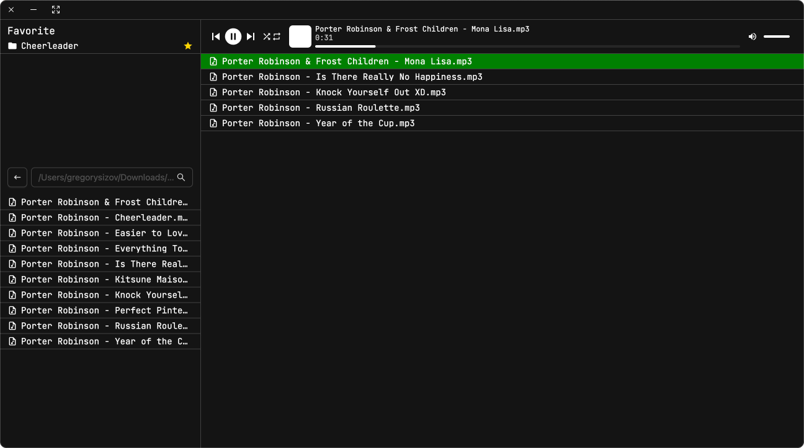

# d0phamine music player

</img>

Simple Electron desktop multi-platform music application.

(Its working on MacOS, Windows and Linux)

> Written with the help of modern technologies of ReactJS and TypeScript
>
> _“Don't judge me too harshly, this is my first public pet project.”_

---

## Functionality 🥹

1. **Very important** - its just play your saved music
2. Can save your favorite locations on your computer
3. Have all player functions with looping and shuffling.
4. **Audio visualisation** of your playing music
5. **Big player** for a more detailed look at the cover and a beautiful display of the playback
6. Also, for most English-language compositions, the Big player provides synchronized subtitles

_Yes it looks simple, but I will continue to work on it and add new cool features, believe me!!!_

## My thoughts for the future

1. Adding custom playlists (with location independent tracks)
2. Custom user themes
3. Аdding functionality for external APIs (Spotify, Genius, Youtube)
4. Work is already underway on native player support in the notification line for all operating systems
5. Maybe EQ
